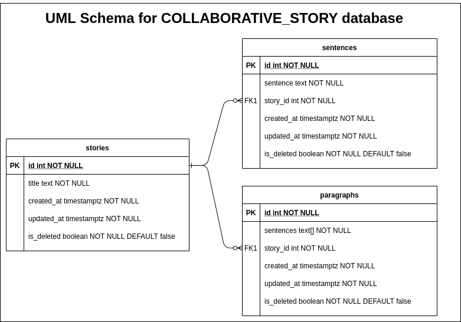

# Collaborative Story
Problem Statement: 
https://drive.google.com/file/d/1SF2rsgeiatEkrPZIxZsqf2n8EzuDGxH-/view

## Prerequisites for Development
1. PostgreSQL
2. Go
3. Docker
4. [Migrate](https://github.com/golang-migrate/migrate/tree/master/cmd/migrate) (optional)

## Assumptions
* All API Endpoints start with `api/v1/`
* Server to run on port provided by user in environment variable as `SERVER_PORT`
* Once the story is complete it cannot be updated afterwards.
* No authentication or authorization is required to make API calls.

## ER Diagram for Database


## How to run your code?

1. Create postgres database with the name `collaborative_story`  (For first time run)
2. Run the code using
```sh
make run
```
## Docker

You can run this code easily on a Docker container.
Just run the following commands:

```sh
docker-compose up -d (-d for running the server in detailed mode)
docker exec -it postgres_1 bash

bash-4.4# psql -U postgres --password
Password: 
psql (11.1)
Type "help" for help.
postgres=# CREATE DATABASE collaborative_story;
CREATE DATABASE
postgres=# exit;
bash-4.4# exit;
exit
```

## If you had more time, what would you do differently?

* Complete Tests 
* Do Benchmarking
* Apply best practices for Sorting, Filtering, and Pagination
* Complete the `TODO` mentioned in the source code
* Improve Migrations writing practice

* Create the database inside the container or via migrations
* As scale is high i.e. 1000 RPS. So instead of inserting words at every
POST(/add) call, I would do batch insertions after every minute or 5 mins. But in
this case, GET calls won’t give the latest response. i.e. if we want latest response every time or is it fine if we render stale response? In every DB call, to insert or update, DB server CPU usage will rise and might break the application. OR as an alternative we can use MQ for handling words insertions.
As based on product, Collaborative Story can anyways have stale response, batch insertion can be preferred.

* Implement caching for fetch stories by id. As in problem statement, it is not
mentioned that story can be updated later, after its completion so each
story response can be cached. It can be done using nginx, redis or any other web
server. We can use `story_id` as key with 10 minutes or 30 minutes TTL

* Would have used interfaces so that cycle of all layers can be completed appropriately.

* Improve the ER diagram with proper relation between `sentences` and `paragraphs` table

### NOTE 
> ```diff
>- NEVER MAKE CHANGES IN ANY MIGRATION FILE-
>+IN CASE OF ANY CHANGES REQUIRED IN DB TABLES, WRITE A NEW ALTER MIGRATION +
> ```


